# Entity-Relationship Diagram
## Rural Health Chatbot System

This document provides a comprehensive ER diagram for the Rural Health Chatbot project using traditional ER diagram notation (Chen notation style with rectangles, diamonds, and ovals).

---

## Traditional ER Diagram - Chen Notation Style


---

## Traditional ER Diagram - Crow's Foot Notation

```mermaid
erDiagram
    ACCOUNT ||--o| HEALTH-WORKER-PROFILE : "has profile"
    ACCOUNT ||--o{ APPOINTMENT : "creates (villager)"
    ACCOUNT ||--o{ APPOINTMENT : "assigned to (health worker)"
    ACCOUNT ||--o{ CHAT-HISTORY : "has conversations"
    ACCOUNT ||--o{ CONTACT-ENQUIRY : "submits enquiry"
    ACCOUNT ||--o{ CONTACT-ENQUIRY : "responds to enquiry"
    ACCOUNT ||--o{ DOCUMENT : "uploads"
    
    ACCOUNT {
        int id PK "Primary Key"
        string username UK "Unique"
        string email UK "Unique"
        string first_name
        string last_name
        string phone_number
        string role "villager|health_worker|admin"
        string password "Hashed"
        datetime date_joined
        datetime last_login
        boolean is_admin
        boolean is_staff
        boolean is_active
        boolean is_superadmin
    }
    
    HEALTH-WORKER-PROFILE {
        int id PK
        int user_id FK "→ ACCOUNT(id)"
        string specialization
        string qualification
        int experience_years
        boolean availability
    }
    
    APPOINTMENT {
        int id PK
        int villager_id FK "→ ACCOUNT(id)"
        int healthworker_id FK "→ ACCOUNT(id) NULL"
        date date
        time time
        text reason
        string status "pending|approved|completed|cancelled"
        text note
        uuid token UK "Unique Token"
        datetime created_at
    }
    
    CHAT-HISTORY {
        int id PK
        int user_id FK "→ ACCOUNT(id)"
        text question
        text answer
        datetime timestamp
    }
    
    CONTACT-ENQUIRY {
        int id PK
        int user_id FK "→ ACCOUNT(id) NULL"
        string first_name
        string last_name
        string email
        string phone
        text message
        string status "pending|in_progress|resolved"
        text admin_response "NULL"
        datetime created_at
        datetime updated_at
        int responded_by FK "→ ACCOUNT(id) NULL"
    }
    
    DOCUMENT {
        int id PK
        string title
        file file "File Path"
        text summary
        int uploaded_by FK "→ ACCOUNT(id)"
        datetime created_at
        datetime updated_at
    }
    
    AWARENESS {
        int id PK
        string title
        text description
        image photo "Image Path"
        file pdf "PDF Path NULL"
        date event_date "NULL"
        boolean is_event
        datetime created_at
    }
```



---

## ER Diagram Notation Legend

### Traditional ER Diagram Symbols

```
┌─────────────────────────────────────────────────────────────┐
│  ENTITY (Rectangle)                                         │
│  ┌─────────────────┐                                        │
│  │   ENTITY NAME   │                                        │
│  └─────────────────┘                                        │
│                                                             │
│  ATTRIBUTES (Ovals)                                         │
│      ╭───────╮                                              │
│      │ attr1 │                                              │
│      ╰───────╯                                              │
│                                                             │
│  PRIMARY KEY (Underlined Oval)                              │
│      ╭═══════╮                                              │
│      ║  PK   ║                                              │
│      ╰═══════╯                                              │
│                                                             │
│  RELATIONSHIP (Diamond)                                     │
│         ◇                                                   │
│        ◇ ◇    RELATIONSHIP NAME                             │
│         ◇                                                   │
│                                                             │
│  CARDINALITY NOTATIONS:                                     │
│  ──1── : Exactly One                                        │
│  ──N── : Many (Zero or More)                                │
│  ──M── : Many (in M:N relationships)                        │
│  ──1..* : One or More                                       │
│  ──0..1 : Zero or One (Optional)                            │
│  ──0..* : Zero or More                                      │
└─────────────────────────────────────────────────────────────┘
```

### Crow's Foot Notation Guide

```
┌─────────────────────────────────────────────────────────────┐
│  ||──  : Exactly One (Mandatory)                            │
│  |o──  : Zero or One (Optional)                             │
│  }o──  : Zero or Many                                       │
│  }|──  : One or Many                                        │
│                                                             │
│  Example: ENTITY1 ||--o{ ENTITY2                            │
│  Reads as: "One ENTITY1 to Zero or Many ENTITY2"            │
└─────────────────────────────────────────────────────────────┘
```

---

## ASCII Art Traditional ER Diagram

```
                    ╔════════════════════════════════════════╗
                    ║           ACCOUNT (User)               ║
                    ║────────────────────────────────────────║
                    ║ PK: id                                 ║
                    ║ UK: username, email                    ║
                    ║ • first_name, last_name                ║
                    ║ • phone_number, password               ║
                    ║ • role (villager/health_worker/admin)  ║
                    ║ • date_joined, last_login              ║
                    ║ • is_admin, is_staff, is_active        ║
                    ╚════════════════════════════════════════╝
                              │        │
                    ┌─────────┘        └────────────────┐
                    │                                    │
            ───────1│                                    │1───────
                    │                                    │
              ╱╲────┴────╱╲                         ╱╲──┴────╱╲
             ╱  ╲  HAS   ╱  ╲                      ╱  ╲CREATES╱  ╲
            ╱    ╲PROFILE    ╱                    ╱    ╲      ╱    ╱
            ╲    ╱      ╲    ╱                    ╲    ╱      ╲    ╱
             ╲  ╱        ╲  ╱                      ╲  ╱        ╲  ╱
              ╲╱──────────╲╱                        ╲╱──────────╲╱
                    │0..1                                 │N
            ────────┴────────                      ───────┴─────────
            │                                      │
    ╔═══════════════════════╗          ╔═══════════════════════════╗
    ║ HEALTH WORKER PROFILE ║          ║      APPOINTMENT          ║
    ║───────────────────────║          ║───────────────────────────║
    ║ PK: id                ║          ║ PK: id                    ║
    ║ FK: user_id           ║          ║ FK: villager_id           ║
    ║ • specialization      ║          ║ FK: healthworker_id (NULL)║
    ║ • qualification       ║          ║ UK: token (UUID)          ║
    ║ • experience_years    ║          ║ • date, time              ║
    ║ • availability        ║          ║ • reason, note            ║
    ╚═══════════════════════╝          ║ • status, created_at      ║
                                       ╚═══════════════════════════╝
                                                  │
                                                  │N
                                            ╱╲────┴─────╱╲
                                           ╱  ╲ ASSIGNED╱  ╲
                                          ╱    ╲   TO  ╱    ╱
                                          ╲    ╱      ╲    ╱
                                           ╲  ╱        ╲  ╱
                                            ╲╱──────────╲╱
                                                  │0..1
                                                  │
                                        ──────────┴─────────
                                        │
                                    (connects back to ACCOUNT
                                     with health_worker role)


         ACCOUNT ─────1───╱╲─────╱╲─────N───→ CHAT HISTORY
                         ╱  ╲ CHATS╱  ╲
                        ╱    ╲    ╱    ╱          ╔═══════════════════════╗
                        ╲    ╱    ╲    ╱          ║    CHAT HISTORY       ║
                         ╲  ╱      ╲  ╱           ║───────────────────────║
                          ╲╱────────╲╱            ║ PK: id                ║
                                                  ║ FK: user_id           ║
                                                  ║ • question            ║
         ACCOUNT ─────1───╱╲─────╱╲─────N───→    ║ • answer              ║
                         ╱  ╲SUBMITS╱  ╲         ║ • timestamp           ║
                        ╱    ╲    ╱    ╱          ╚═══════════════════════╝
                        ╲    ╱    ╲    ╱
                         ╲  ╱      ╲  ╱
                          ╲╱────────╲╱            ╔═══════════════════════╗
                                │                 ║   CONTACT ENQUIRY     ║
                                └────N───→        ║───────────────────────║
                                                  ║ PK: id                ║
                                                  ║ FK: user_id (NULL)    ║
         ACCOUNT ─────0..1─╱╲──────╱╲────N───→   ║ FK: responded_by(NULL)║
                          ╱  ╲RESPONDS╱  ╲       ║ • first_name          ║
                         ╱    ╲  TO ╱    ╱       ║ • last_name, email    ║
                         ╲    ╱     ╲    ╱       ║ • phone, message      ║
                          ╲  ╱       ╲  ╱        ║ • status              ║
                           ╲╱─────────╲╱         ║ • admin_response      ║
                                │                ║ • created_at          ║
                                └───(another FK) ╚═══════════════════════╝


         ACCOUNT ─────1───╱╲─────╱╲─────N───→ DOCUMENT
                         ╱  ╲UPLOADS╱  ╲
                        ╱    ╲    ╱    ╱          ╔═══════════════════════╗
                        ╲    ╱    ╲    ╱          ║      DOCUMENT         ║
                         ╲  ╱      ╲  ╱           ║───────────────────────║
                          ╲╱────────╲╱            ║ PK: id                ║
                                                  ║ FK: uploaded_by       ║
                                                  ║ • title               ║
                                                  ║ • file (path)         ║
                                                  ║ • summary             ║
                                                  ║ • created_at          ║
        ╔═══════════════════════╗                ║ • updated_at          ║
        ║     AWARENESS         ║                ╚═══════════════════════╝
        ║───────────────────────║
        ║ PK: id                ║    (Independent Entity - No direct FK)
        ║ • title               ║
        ║ • description         ║
        ║ • photo (image)       ║
        ║ • pdf (NULL)          ║
        ║ • event_date (NULL)   ║
        ║ • is_event            ║
        ║ • created_at          ║
        ╚═══════════════════════╝
```

---

## Relationship Cardinality Table

| Relationship | Entity 1 | Cardinality | Entity 2 | Description |
|-------------|----------|-------------|----------|-------------|
| HAS PROFILE | Account | 1 : 0..1 | HealthWorkerProfile | Each account MAY have one profile (only health workers) |
| CREATES | Account (Villager) | 1 : N | Appointment | Each villager can create many appointments |
| ASSIGNED TO | Account (Health Worker) | 0..1 : N | Appointment | Each appointment MAY be assigned to one health worker |
| CHATS | Account | 1 : N | ChatHistory | Each user can have many chat conversations |
| SUBMITS | Account | 0..1 : N | ContactEnquiry | Each enquiry MAY be submitted by a user (or anonymous) |
| RESPONDS TO | Account (Admin) | 0..1 : N | ContactEnquiry | Each enquiry MAY be responded to by an admin |
| UPLOADS | Account | 1 : N | Document | Each document is uploaded by one user |

---

## Entity Descriptions

### 1. **Account** (User Management)
- **Purpose**: Central user entity for authentication and authorization
- **User Types**: 
  - Villager (default)
  - Health Worker
  - Admin
- **Key Features**: Role-based access control, custom user manager

### 2. **HealthWorkerProfile**
- **Purpose**: Extended profile for health workers
- **Relationship**: One-to-One with Account
- **Key Features**: Stores professional qualifications and availability

### 3. **Appointment**
- **Purpose**: Manages appointment scheduling between villagers and health workers
- **Key Features**: 
  - Status tracking (pending → approved → completed/cancelled)
  - Unique token for appointment verification
  - Notes field for additional information

### 4. **ChatHistory**
- **Purpose**: Stores conversational history with the AI chatbot
- **Key Features**: 
  - Timestamp-based ordering
  - Question/answer pairs
  - Preview methods for truncated display

### 5. **ContactEnquiry**
- **Purpose**: Manages user enquiries and support tickets
- **Key Features**:
  - Status workflow (pending → in_progress → resolved)
  - Admin response capability
  - Can be submitted by authenticated or anonymous users

### 6. **Document**
- **Purpose**: Stores medical and health-related documents
- **Key Features**:
  - UUID-based file naming
  - Automatic vector database integration for RAG
  - Cascade deletion of related vectors

### 7. **Awareness**
- **Purpose**: Manages health awareness content and events
- **Key Features**:
  - Can be informational content or event
  - Supports both images and PDF attachments
  - Optional event dates

---

## Relationship Details

### Account ↔ HealthWorkerProfile
- **Type**: One-to-One (Optional)
- **Description**: Health workers have an extended profile with professional details
- **On Delete**: CASCADE (if account deleted, profile is deleted)

### Account → Appointment (as Villager)
- **Type**: One-to-Many
- **Description**: Villagers can create multiple appointments
- **Foreign Key**: `villager_id`
- **On Delete**: CASCADE

### Account → Appointment (as Health Worker)
- **Type**: One-to-Many
- **Description**: Health workers can be assigned to multiple appointments
- **Foreign Key**: `healthworker_id`
- **On Delete**: SET_NULL (appointments remain if health worker account deleted)

### Account → ChatHistory
- **Type**: One-to-Many
- **Description**: Each user can have multiple chat conversations
- **On Delete**: CASCADE

### Account → ContactEnquiry (as Submitter)
- **Type**: One-to-Many
- **Description**: Users can submit multiple enquiries
- **Foreign Key**: `user_id`
- **On Delete**: CASCADE
- **Note**: Can be NULL for anonymous submissions

### Account → ContactEnquiry (as Responder)
- **Type**: One-to-Many
- **Description**: Admins can respond to multiple enquiries
- **Foreign Key**: `responded_by`
- **On Delete**: SET_NULL

### Account → Document
- **Type**: One-to-Many
- **Description**: Users (typically health workers/admins) can upload multiple documents
- **On Delete**: CASCADE

### Awareness (Standalone Entity)
- **Type**: Independent
- **Description**: No direct relationship with users (managed by admins)

---

## Key Business Rules

1. **Account Roles**:
   - Default role is "villager"
   - Only health workers get HealthWorkerProfile
   - Only admins can respond to ContactEnquiry

2. **Appointments**:
   - Must have a villager (required)
   - Health worker can be assigned later (optional at creation)
   - Unique token generated for each appointment
   - Status progression: pending → approved → completed/cancelled

3. **Documents**:
   - Automatically indexed in vector database on upload
   - Vector embeddings deleted when document is removed
   - UUID-based file naming prevents conflicts

4. **Contact Enquiries**:
   - Can be submitted by authenticated or anonymous users
   - Status workflow ensures proper handling
   - Tracks who responded for accountability

5. **Chat History**:
   - Ordered by timestamp (newest first)
   - Preserves complete conversation history
   - No cascade deletion from user side

---

## Technical Notes

- **Primary Keys**: All entities use auto-incrementing integer IDs
- **Foreign Keys**: Properly indexed for query performance
- **Unique Constraints**: 
  - Account: username, email
  - Appointment: token (UUID)
- **Soft Deletes**: Not implemented; using CASCADE and SET_NULL strategies
- **Timestamps**: 
  - `created_at` (auto_now_add): Set once on creation
  - `updated_at` (auto_now): Updated on every save
  - `last_login` (auto_now): Updated on authentication

---

## Database Indexes (Recommended)

```sql
-- Account
CREATE INDEX idx_account_role ON accounts_account(role);
CREATE INDEX idx_account_email ON accounts_account(email);

-- Appointment
CREATE INDEX idx_appointment_status ON appointments_appointment(status);
CREATE INDEX idx_appointment_date ON appointments_appointment(date);
CREATE INDEX idx_appointment_villager ON appointments_appointment(villager_id);
CREATE INDEX idx_appointment_healthworker ON appointments_appointment(healthworker_id);

-- ChatHistory
CREATE INDEX idx_chat_user ON chat_chathistory(user_id);
CREATE INDEX idx_chat_timestamp ON chat_chathistory(timestamp);

-- ContactEnquiry
CREATE INDEX idx_contact_status ON contact_contactenquiry(status);
CREATE INDEX idx_contact_user ON contact_contactenquiry(user_id);

-- Document
CREATE INDEX idx_document_uploaded_by ON documents_document(uploaded_by);
CREATE INDEX idx_document_created_at ON documents_document(created_at);
```

---

## Entity Statistics Summary

| Entity | Attributes | Relationships | Unique Constraints |
|--------|-----------|---------------|-------------------|
| Account | 13 | 7 outgoing | email, username |
| HealthWorkerProfile | 5 | 1 incoming | - |
| Appointment | 10 | 2 incoming | token |
| ChatHistory | 5 | 1 incoming | - |
| ContactEnquiry | 11 | 2 incoming | - |
| Document | 7 | 1 incoming | - |
| Awareness | 8 | 0 | - |

**Total Entities**: 7  
**Total Relationships**: 9  
**Central Entity**: Account (hub for all user-related activities)

---

*Last Updated: October 25, 2025*  
*Project: Rural Health Chatbot System*
